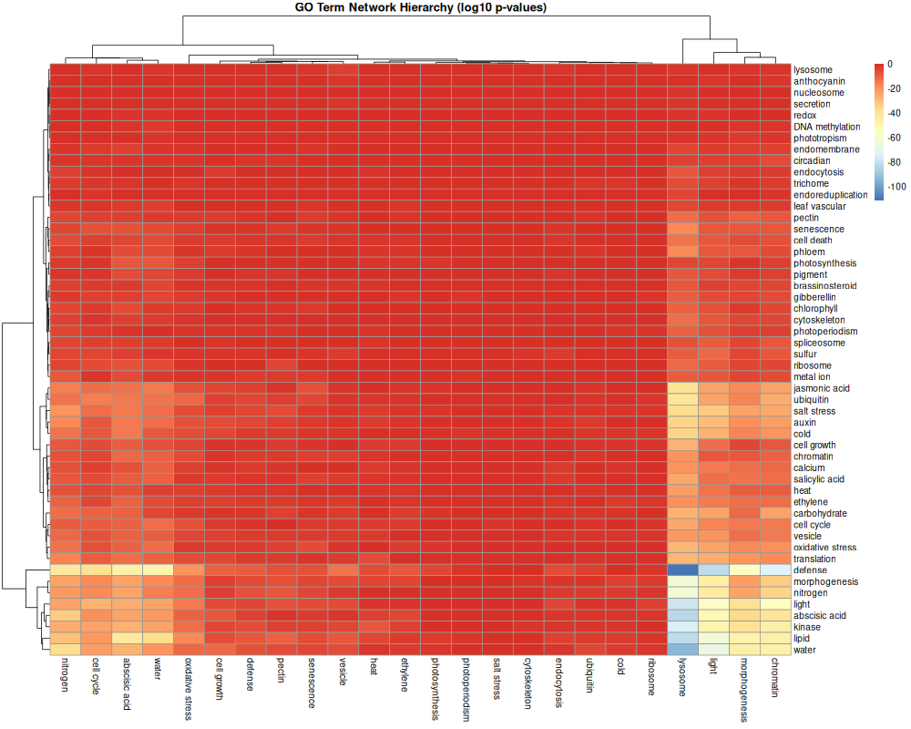

# Gene Regulatory Network Analysis - *Arabidopsis thaliana* Flower Development

A comprehensive analysis of G-box regulatory networks in *Arabidopsis thaliana* flower development using single-cell RNA-seq data. This project combines network inference, topological analysis, and functional enrichment to identify key transcription factors controlling floral gene expression.

## Overview

This project constructs and analyses gene regulatory networks from single-cell RNA-seq data of *Arabidopsis* flowers, focusing on transcription factors that bind G-box motifs. The analysis compares single-cell-derived networks with the established AraBOXcis network (trained on bulk RNA-seq from seedlings) to identify tissue-specific regulatory relationships.

**Key techniques:**
- Single-cell RNA-seq data processing and quality control.
- Gene regulatory network inference using GENIE3.
- Network topology analysis (degree, betweenness, centrality, hub scores).
- Gene Ontology enrichment and pathway analysis.

## Key Findings

- **Network Construction:** Inferred a gene regulatory network containing 44,796 edges from single-cell flower data.
- **Network Comparison:** Identified 8,280 shared regulatory edges between single-cell and bulk RNA-seq networks, with 36,516 edges unique to each dataset, highlighting tissue-specific regulatory mechanisms.
- **Hub Transcription Factors:** AT5G08130 identified as the most highly connected TF with 1,875 target genes, followed by AT3G24140 (1,511 targets) and AT3G57800 (1,446 targets).
- **Regulatory Relationships:** Discovered 211 strong positive TF-target pairs with significant co-occurrence in single cells (odds ratio > e).
- **GO Term Hierarchy:** Revealed upstream-downstream relationships between biological processes in the flower regulatory network.

## Results

### Single-Cell Data Quality and Cell Type Clustering


**Figure 1:** UMAP projection of G-box gene expression across 12 cell type clusters in *Arabidopsis* flowers. Distinct clustering indicates high-quality single-cell data and clear cell type separation.

### Network Inference and Comparison


**Figure 2:** Comparison of transcription factor degrees between SinceAraBOXcis (single-cell flower network) and AraBOXcis (bulk seedling network). Weak correlation indicates substantial tissue-specific regulatory rewiring between flowers and seedlings.


**Figure 3:** Distribution of transcription factor degrees showing a scale-free network topology. Most TFs regulate few targets, while hub TFs (right tail) coordinate expression of hundreds to thousands of genes.

### Network Topology Analysis


**Figure 4:** Comparison of hub score and alpha centrality metrics. The strong vertical distribution at low hub scores indicates many genes with high influence despite low connectivity, suggesting regulatory importance beyond simple degree centrality.

### Functional Enrichment



**Figure 5:** PAFway analysis revealing hierarchical relationships between Gene Ontology terms in the regulatory network. Red indicates GO terms significantly enriched upstream of other terms (lower p-values), revealing biological process ordering during flower development.

## Project Structure

```
.
├── README.md                               # Project documentation
├── flower_gene_network_analysis.R          # Main analysis script
├── data/                                   # Input data (not uploaded to GitHub)
│   ├── flowerdata.RData                    # Single-cell RNA-seq expression matrix
│   ├── gboxNetwork22C.csv                  # Reference AraBOXcis network
│   ├── clusterLabels.txt                   # Cell type annotations
│   └── functionalData.RData                # Gene Ontology annotations
├── results/                                # Analysis outputs
│   ├── tables/                             # Quantitative results
│   │   ├── Flower_avgExpressionByCluster.txt
│   │   ├── Flower_doublePositives.txt
│   │   ├── Flower_SimpsonPairs.txt
│   │   ├── centrality_flower.RData
│   │   └── centrality_all_flower.RData
│   ├── networks/
│   │   └── Flower_Network_nTree_5.RData    # Inferred GENIE3 network
│   └── figures/                            # Publication-quality visualisations
├── cytoscape/                              # Network visualisation files
│   └── network_files/                      # .sif, .csv, .cys files for Cytoscape
└── dev/
    └── utilities/
        └── dataprocessingHelperFunctions.R # Helper functions
```

## Methodology

### 1. Data Processing & Quality Control
- Removed cells expressing <1% of genes.
- Removed genes expressed in <1% of cells.
- Retained high-quality data for downstream analysis.

### 2. Exploratory Analysis
- UMAP and PCA for dimensionality reduction and visualisation.
- Cluster-based average gene expression profiles.
- Identification of cell type-specific expression patterns.

### 3. Correlation Analysis
- Spearman correlation at cell type level.
- Odds ratio analysis at single-cell level to account for zero-inflation.
- Identification of Simpson's paradox cases (correlations that differ between aggregation levels).

### 4. Network Inference
- **GENIE3** random forest-based network inference.
- Input: Gene expression matrix + list of G-box binding transcription factors.
- Output: Ranked list of regulatory edges with confidence scores.

### 5. Network Topology Analysis
Multiple centrality metrics to identify important regulatory genes:
- **Degree centrality:** Number of target genes per TF.
- **Betweenness centrality:** Genes bridging different network regions.
- **Alpha centrality:** Influence considering neighbours' connectivity.
- **Hub score:** TFs regulating many well-connected targets.

### 6. Functional Enrichment
- **PAFway analysis:** Identifies GO terms enriched upstream/downstream of other GO terms.
- Reveals hierarchical relationships between biological processes in the network.

## Requirements

```r
# CRAN packages
install.packages(c("Matrix", "umap", "pheatmap", "igraph", "network"))

# Bioconductor packages
BiocManager::install("GENIE3")
```

## Usage

1. **Clone the repository:**
   ```bash
   git clone https://github.com/MathewJohansson/Arabidopsis-Gene-Regulatory-Networks.git
   cd Arabidopsis-Gene-Regulatory-Networks
   ```

2. **Open R Project:**
   - Open `Project 2. Gene Regulatory Networks.Rproj` in RStudio

3. **Run the analysis:**
   ```r
   source("flower_gene_network_analysis.R")
   ```
   
   Note: GENIE3 network inference is computationally intensive (~15-30 minutes depending on hardware).

4. **View results:**
   - Quantitative results: `results/tables/`
   - Network object: `results/networks/`
   - Figures: `results/figures/`

## Key Results Files

| File | Description |
|------|-------------|
| `Flower_avgExpressionByCluster.txt` | Average gene expression for each cell type |
| `Flower_doublePositives.txt` | Strong TF-target pairs (odds ratio > e) |
| `Flower_SimpsonPairs.txt` | Pairs showing Simpson's paradox |
| `Flower_Network_nTree_5.RData` | Complete GENIE3-inferred network |
| `centrality_flower.RData` | Network centrality metrics for all genes |

## Biological Interpretation

The analysis reveals that single-cell and bulk RNA-seq networks capture different aspects of gene regulation:

- **Shared edges (8,280):** Core regulatory relationships conserved across tissues and developmental stages.
- **Tissue-specific edges (36,516 each):** Regulatory mechanisms specific to flower development vs seedling growth.
- **Hub transcription factors:** Highly connected TFs (e.g., AT5G08130) likely play master regulatory roles in coordinating flower development.
- **Simpson's paradox cases:** TF-target pairs correlated at the cell type level but not at single-cell level suggest context-dependent regulation.

## References

- **G-box regulatory code:** Ezer, D. et al. (2017) "The G-Box Transcriptional Regulatory Code in Arabidopsis" *Plant Physiology* 175(2):628-640.
- **GENIE3:** Huynh-Thu, V.A. et al. (2010) "Inferring Regulatory Networks from Expression Data Using Tree-Based Methods" *PLoS ONE* 5(9):e12776.
- **Dataset:** Procko, C. et al. (2023) "A single cell developmental atlas for a whole plant" *Nature Plants* (GEO: GSE226097).

## Author

**Mathew Johansson**  
MSc Bioinformatics, University of York  
Voluntary Research Associate, Jeffares Lab  
[GitHub](https://github.com/MathewJohansson) | [LinkedIn](https://www.linkedin.com/in/mathew-johansson/))

## Acknowledgements

This project was completed as part of the MSc in Bioinformatics at the University of York, building upon the collaborative SinceAraBOXcis project framework.
